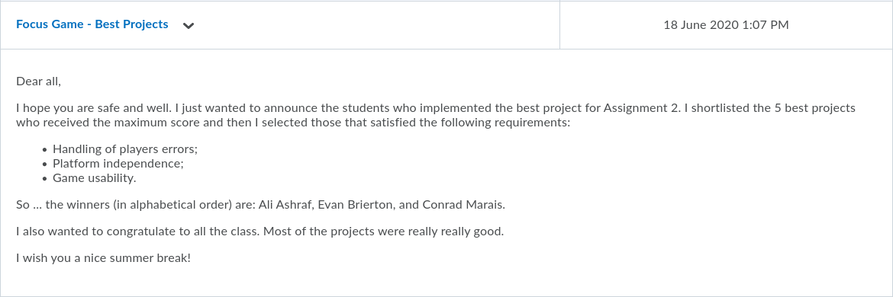

# Focus
Focus (Board Game) & Winner of Best Project
[](https://asciinema.org/a/xfSZIlrkSyhbYbSkXhlOcXpwF)
### Introduction
This is a game made for COMP10050 Software Engineering Project 1.

It's based on the [Focus Board Game](https://en.wikipedia.org/wiki/Focus_(board_game))

Grade Received: A+ (100%)


### Dependencies
[CMake](https://cmake.org/download/) is the easiest way to build the files.
##### CMake Build Steps
```commandline
git clone https://github.com/ash-xyz/Focus.git
cd Focus
mkdir build
cd build
cmake .. 
cmake --build 
```

#### Macintosh
Mac systems come pre-installed with ncurses so it should run instantly

#### Linux
##### Ubuntu
Make sure to install the following ncurses libraries using 

``` sudo apt-get install libncurses5-dev libncursesw5-dev```
##### Other
Finding ncurses might be a pain from some users as where it's installed varies from user to user

One user suggested the use of 
```
set( CURSES_INCLUDE_PATH "/usr/include")
set( CURSES_LIBRARY "/usr/lib/libncurses.so")
```

This'll differ from user to user due to how linux installs stuff from user to user.
#### Windows
Your best bet is to use the [Windows Subsystem for Linux.](https://medium.com/@CodeBriefly/setup-windows-subsystem-linux-wsl-on-windows-10-a3e50c36b59b) 
### Running
Once you've got the game compiled, run it in an external terminal(Not the one that comes with CLion).

Make sure to put the terminal to full screen.

Enjoy!
